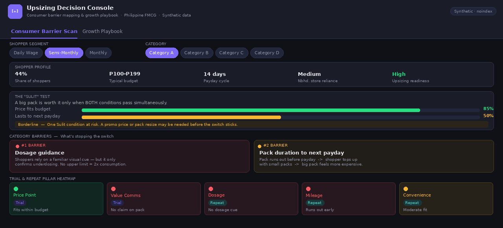

# Upsizing Decision Console

Interactive tool for mapping consumer upsizing barriers and diagnosing growth playbook gaps across FMCG categories in the Philippine market.



---

## What it does

**Tab 1 — Consumer Barrier Scan**
Select a shopper income segment and category to see:
- The *Sulit* equation — whether price fit and pack duration both clear the bar for the shopper to consider a big pack worth it
- The #1 and #2 conversion barriers specific to that category
- A five-pillar heatmap (Price Point · Value Comms · Dosage · Mileage · Convenience) split by Trial and Repeat phase, with status and recommended action per pillar

**Tab 2 — Growth Playbook**
Select a category to see:
- A synthetic three-brand scorecard across five growth dimensions
- The five Nielsen-informed principles that separate upsizing leaders from the field
- A priority gap table comparing leader scores against the category average

---

## Key concepts modelled

**The Sulit framework** — Filipino shoppers evaluate big packs against two simultaneous conditions: (1) the price fits within their budget window, and (2) the pack will last until their next payday. Both must pass for the purchase to feel genuinely worth it. Failing either condition sends the shopper back to small packs.

**Trial vs. Repeat distinction** — Barriers split across two phases. Trial barriers (price point, value communication) determine whether the shopper picks up the big pack. Repeat barriers (dosage, mileage, convenience) determine whether they come back. Fixing trial without fixing repeat produces a one-time purchase, not a habit.

**Shopper income segmentation** — Three segments with distinct payday cycles (daily, fortnightly, monthly) drive different upsizing readiness profiles. The tool weights the Sulit equation by segment to reflect these dynamics.

---

## Data

All data is synthetic. Scripts are included to show the analytical structure.

| File | Purpose |
|------|---------|
| `01_generate_data.py` | Generates category barrier matrices, shopper segment profiles, synthetic brand scores, and growth principle definitions; outputs `data.json` |
| `02_build_tool.py` | Injects `data.json` into the self-contained `index.html` |
| `index.html` | The interactive tool — no dependencies, no external calls |

To regenerate:
```bash
python3 01_generate_data.py
python3 02_build_tool.py
```

---

## Context

Built as a portfolio piece translating qualitative consumer research (in-home visits, shop-alongs) and retail panel data into an interactive diagnostic. The framework covers four FMCG categories with distinct #1 barriers — dosage guidance, convenience, entry price point, and value communication legibility — and five growth principles derived from competitive upsizing case studies.

Category names are abstracted (A–D). No proprietary or confidential data is included.

---

*Synthetic data · noindex · leilistiic.github.io*
